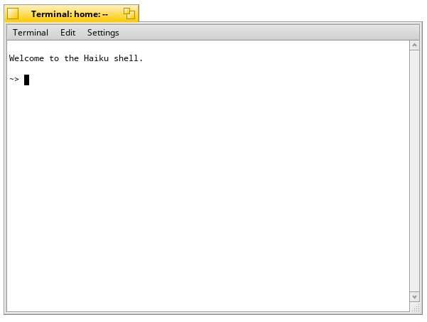
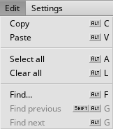

Terminal
========

>_Terminal_ allows you to access your system's shell and execute commands.

When you launch Terminal you will be shown a window with a shell in it where you can type commands and hit enter to execute them. The shell used is, by default, **bash**.

---

Under the `Terminal` menu one will find options related to the Terminal application itself.

 

1. `Switch Terminals` (`ALT`+`TAB`) allows one to switch between instances of the Terminal application.
2. `New Terminal` (`ALT`+`N`) allows one to make a new instance of the Terminal application.
3. `New tab` (`ALT`+`T`) allows one to create a new tab in the current Terminal instance.
4. `Page setup...` allows one to setup the parameters for the printing of the shell's screen.
5. `Print` (`ALT`+`P`) allows one to print the shell's screen
6. `Close window` (`SHIFT`+`ALT`+`W`) closes the current Terminal instance.
7. `Close active tab` (`ALT`+`W`) closes the current tab.
8. `Quit` (`ALT`+`Q`) closes the current current Terminal instance.

---

Under the `Edit` menu one will find options related to the text aspect of the Terminal.

 

1. `Copy` (`ALT`+`C`) will copy the selected text to the clipboard.
2. `Paste` (`ALT`+`P`) will paste the current text in the clipboard.
3. `Select All` (`ALT`+`A`) will select all the text.
4. `Clear all` (`ALT`+`L`) {what does this do?}.
5. `Find...` (`ALT`+`F`) will search for an occurence of a given word.
6. `Find previous` (`SHIFT`+`ALT`+`G`) will go to the previous occurence of the word being searched for.
7. `Find next` (`ALT`+`G`) will go to the next occurence of the word being searched for.
